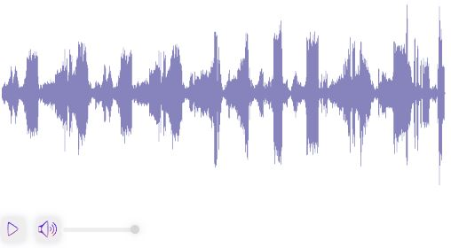

# React Rhythm Play

Visualization of music playback on react. Provides an audio player component with audio visualization.

[Demo](https://stackblitz.com/edit/react-rhythm-play?file=src%2FApp.tsx)

## Installation

    npm install react-rhythm-play -D

## Usage

Dafault:



```js | pure
import { AudioWave } from "react-rhythm-play";
import audio from "./audio_path.ogg";

const Component = () => {
  return <AudioWave audioSource={audio} height={400} width={750} />;
};

export default Component;
```

With custom audio bar:


```js | pure
import { useRef } from "react";
import { AudioWave, useAudio } from "react-rhythm-play";
import audio from "./audio_path.ogg";

const Component = () => {
  const audioWaveRef = useRef();

  const { togglePlayPause } = useAudio(audioWaveRef);

  return (
    <div>
      <AudioWave
        ref={audioWaveRef}
        height={400}
        width={750}
        audioSource={audio}
        isCustomAudioBar
      />
      <button onClick={togglePlayPause}>play/pause</button>
    </div>
  );
};

export default Component;
```

## Props

| Prop                         | Type                              | Default   | Required | Description                                   |
| ---------------------------- | --------------------------------- | --------- | -------- | --------------------------------------------- |
| `color`                      | string                            | "#8683bd" |          | Audio wave form initial color                 |
| `progressColor`              | string                            |           |          | Audio wave form progress color                |
| `progressGradientStartColor` | string                            | "#411bf4" |          | Audio wave form progress gradient start color |
| `progressGradientEndColor`   | string                            | "#a543a0" |          | Audio wave form progress gradient end color   |
| `width`                      | number                            | 100%      |          | Audio wave form width                         |
| `height`                     | number                            |           | true     | Audio wave form height                        |
| `audioSource`                | string                            |           | true     | Audio source                                  |
| `loadingComponent`           | React.ReactNode                   |           |          | Render component while loading                |
| `errorComponent`             | React.ReactNode                   |           |          | Render component when throw error             |
| `isCustomAudioBar`           | boolean                           | false     |          | Show/hide audio bar                           |
| `onPlayAudio`                | () => void                        |           |          | Called on play audio                          |
| `onPauseAudio`               | () => void                        |           |          | Called on pause audio                         |
| `onAudioRewind`              | (sec: number) => void             |           |          | Called on audio rewind                        |
| `onMuteAudio`                | () => void                        |           |          | Called on mute audio                          |
| `onChangeVolume`             | (volume: VolumeRangeType) => void |           |          | Called on change audio volume                 |
